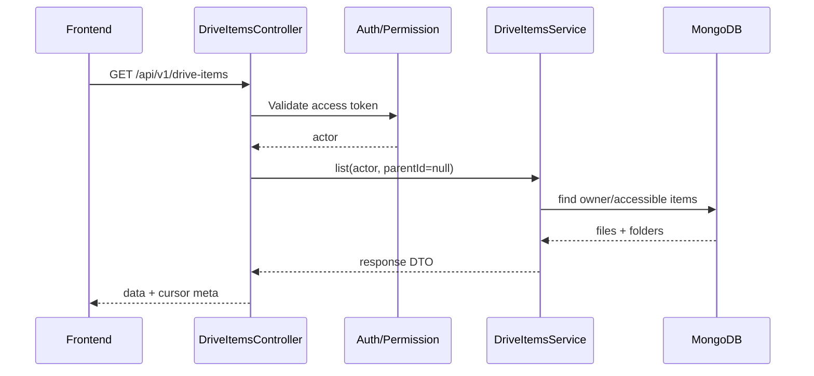
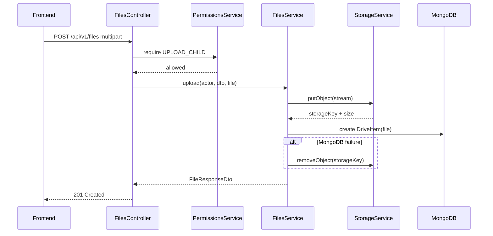

# File Central – Tổng hợp luồng nghiệp vụ và thiết kế RESTful API có khả năng mở rộng

**Phiên bản:** 1.0  
**Mục tiêu:** Chuẩn hóa toàn bộ luồng Drive / Folder / File, thiết kế RESTful API ổn định cho MVP và giảm chi phí thay đổi khi bổ sung module mới.  
**Backend định hướng:** NestJS + MongoDB + Storage abstraction (`LocalStorage` hiện tại, MinIO/S3-compatible về sau).

---

## 1. Mục tiêu thiết kế

Hệ thống cần hỗ trợ các nghiệp vụ chính:

1. Đăng ký, đăng nhập và quản lý phiên người dùng.
2. Hiển thị nội dung Drive tại root hoặc trong một folder.
3. Tạo folder và cây folder nhiều cấp.
4. Upload, download và preview file.
5. Rename và move chung cho cả file lẫn folder.
6. Soft delete vào Trash, restore và hard delete.
7. Share trực tiếp cho user/email hoặc bằng public link.
8. Kế thừa quyền từ folder cha xuống toàn bộ cây con.
9. Search, filter, sort và pagination.
10. Có thể bổ sung quota, activity log, file version, workspace, notification hoặc background processing mà không phải viết lại core.

Các nguyên tắc cốt lõi:

- Folder và file dùng chung collection `drive_items`.
- MongoDB quản lý metadata và nghiệp vụ.
- Storage chỉ quản lý binary.
- API dùng danh từ cho resource, hạn chế route dạng động từ.
- Nghiệp vụ chung của file/folder nằm trong `drive-items`.
- Nghiệp vụ đặc thù nằm trong `folders` hoặc `files`.
- Authentication và authorization tách riêng.
- Controller mỏng; service điều phối nghiệp vụ; repository đóng gói truy vấn.
- Không để module mới truy cập trực tiếp schema nội bộ của module khác nếu không cần thiết.
- Thiết kế response, error, pagination và versioning thống nhất từ đầu.

---

## 2. Mô hình khái niệm

### 2.1. Drive là gì?

`Drive` không phải một document riêng trong MongoDB.

Drive là **góc nhìn tổng hợp** các item tại một vị trí:

```text
Drive(root hoặc folder hiện tại)
├── Folder con
├── Folder con
├── File
└── File
```

Màn hình Drive gọi API danh sách `drive-items`, không gọi riêng folder rồi riêng file.

### 2.2. Folder là gì?

Folder là một `DriveItem` có:

```ts
type: 'folder'
```

Folder chỉ có metadata, không có binary.

### 2.3. File là gì?

File là một `DriveItem` có:

```ts
type: 'file'
```

Ngoài metadata, file có thông tin ánh xạ tới binary trong storage:

```ts
storageProvider: 'local' | 'minio';
storageKey: string;
mimeType: string;
size: number;
checksum?: string;
```

Cả file và folder đều có 2 timestamp ngữ nghĩa riêng (khác với `updatedAt` tự động của Mongoose, vốn bị bump ngay cả khi chỉ xem item):

```ts
lastModifiedAt?: Date | null; // upload / create / rename / move
lastViewedAt?: Date | null;   // download / preview / mở chi tiết (getById)
```

- `lastModifiedAt` chỉ đổi khi nội dung hoặc metadata thay đổi → dùng cho cột "Last modified".
- `lastViewedAt` cập nhật mỗi khi người dùng mở/xem file (fire-and-forget, không bump `updatedAt`).
- Item tạo trước lần deploy này có thể `null`; frontend cần fallback về `createdAt`/`updatedAt` khi hiển thị.

### 2.4. Vì sao file và folder dùng chung collection?

Collection:

```text
drive_items
```

Ví dụ:

```json
[
  {
    "_id": "folder-1",
    "name": "Documents",
    "type": "folder",
    "parentId": null
  },
  {
    "_id": "file-1",
    "name": "CV.pdf",
    "type": "file",
    "parentId": "folder-1"
  }
]
```

Lợi ích:

- Một query lấy được cả file và folder.
- Rename, move, delete, permission và search dùng chung cơ chế.
- `parentId` tạo cây thống nhất.
- Module mới như Trash, Share, Favorites, Activity không cần phân nhánh hai schema.

---

## 3. Kiến trúc module đề xuất

```text
src/
├── app.module.ts
├── main.ts
│
├── config/
│   ├── app.config.ts
│   ├── database.config.ts
│   ├── storage.config.ts
│   └── auth.config.ts
│
├── common/
│   ├── decorators/
│   │   ├── current-user.decorator.ts
│   │   └── permissions.decorator.ts
│   ├── dto/
│   │   ├── cursor-page-query.dto.ts
│   │   └── paginated-response.dto.ts
│   ├── errors/
│   │   └── error-codes.ts
│   ├── filters/
│   │   └── api-exception.filter.ts
│   ├── guards/
│   │   └── permissions.guard.ts
│   ├── interceptors/
│   │   ├── request-id.interceptor.ts
│   │   └── response.interceptor.ts
│   └── types/
│       └── authenticated-user.type.ts
│
├── auth/
│   ├── dto/
│   ├── guards/
│   ├── strategies/
│   ├── schemas/
│   │   └── refresh-token.schema.ts
│   ├── auth.controller.ts
│   ├── auth.service.ts
│   └── auth.module.ts
│
├── users/
│   ├── dto/
│   ├── schemas/
│   │   └── user.schema.ts
│   ├── users.repository.ts
│   ├── users.service.ts
│   ├── users.controller.ts
│   └── users.module.ts
│
├── drive-items/
│   ├── dto/
│   ├── enums/
│   ├── schemas/
│   │   └── drive-item.schema.ts
│   ├── drive-items.repository.ts
│   ├── drive-items.service.ts
│   ├── drive-items.controller.ts
│   └── drive-items.module.ts
│
├── folders/
│   ├── dto/
│   ├── folders.service.ts
│   ├── folders.controller.ts
│   └── folders.module.ts
│
├── files/
│   ├── dto/
│   ├── files.service.ts
│   ├── file-preview.service.ts
│   ├── files.controller.ts
│   └── files.module.ts
│
├── storage/
│   ├── interfaces/
│   │   └── storage-service.interface.ts
│   ├── local-storage.service.ts
│   ├── minio-storage.service.ts
│   ├── storage.constants.ts
│   └── storage.module.ts
│
├── permissions/
│   ├── permissions.service.ts
│   └── permissions.module.ts
│
├── shares/
│   ├── dto/
│   ├── schemas/
│   │   └── share.schema.ts
│   ├── shares.repository.ts
│   ├── shares.service.ts
│   ├── shares.controller.ts
│   └── shares.module.ts
│
├── trash/
│   ├── trash.service.ts
│   ├── trash.controller.ts
│   └── trash.module.ts
│
├── health/
│   ├── health.controller.ts
│   └── health.module.ts
│
└── events/
    ├── domain-events.ts
    └── events.module.ts
```

### Trách nhiệm từng module

| Module | Trách nhiệm |
|---|---|
| `auth` | Đăng nhập, access token, refresh token, logout |
| `users` | Hồ sơ và trạng thái user |
| `drive-items` | Metadata chung, list, detail, rename, move, soft delete |
| `folders` | Tạo folder, breadcrumb, validate cây, chống cycle |
| `files` | Upload, content stream, download, preview |
| `storage` | Lưu, đọc, xóa binary; không biết nghiệp vụ Drive |
| `permissions` | Owner/share/ancestor-chain permission |
| `shares` | Tạo, cập nhật, revoke share |
| `trash` | List trash, restore, purge |
| `common` | Thành phần dùng chung không chứa business domain |
| `events` | Domain events để module mở rộng không coupling trực tiếp |

---

## 4. Ranh giới trách nhiệm quan trọng

### 4.1. `DriveItemsService`

Xử lý hành vi chung:

- List item tại một parent.
- Lấy chi tiết item.
- Search.
- Rename file hoặc folder.
- Move file hoặc folder.
- Soft delete.
- Kiểm tra item tồn tại, owner và trạng thái.
- Chính sách trùng tên theo hành động:
  - **Upload file / tạo folder**: auto-rename kiểu Google Drive (`Whale.png` → `Whale 1.png` → `Whale 2.png`), luôn lấy max+1, không lấp chỗ trống.
  - **Rename / move**: trả `409 Conflict` để người dùng tự quyết định (tránh đổi tên ngoài ý kiến khi dời file).
  - Race condition giữa các request song song vẫn cần unique index để phòng vệ.

### 4.2. `FoldersService`

Xử lý hành vi chỉ folder mới có:

- Tạo folder.
- Kiểm tra parent là folder hợp lệ.
- Tạo breadcrumb.
- Chống move folder vào chính nó hoặc vào descendant.
- Xác định subtree khi xóa/restore.
- Không xử lý binary.

### 4.3. `FilesService`

Xử lý hành vi chỉ file mới có:

- Upload.
- Điều phối storage + metadata.
- Rollback khi storage/DB không đồng bộ.
- Download.
- Preview.
- Không tự xử lý permission; gọi `PermissionsService`.

### 4.4. `StorageService`

Chỉ biết binary:

```ts
interface StorageService {
  putObject(input: PutObjectInput): Promise<StoredObject>;
  getObjectStream(key: string): Promise<Readable>;
  removeObject(key: string): Promise<void>;
  objectExists(key: string): Promise<boolean>;
}
```

Storage không được biết:

- `parentId`.
- Folder tree.
- Share.
- User permission.
- Trash.
- Tên hiển thị của file nếu không cần thiết.

### 4.5. `PermissionsService`

Là điểm duy nhất quyết định user được làm gì:

```ts
requireAccess(
  actor: AuthenticatedUser,
  itemId: string,
  action: PermissionAction,
): Promise<void>
```

Các action ví dụ:

```text
VIEW_METADATA
LIST_CHILDREN
UPLOAD_CHILD
DOWNLOAD
PREVIEW
RENAME
MOVE
DELETE
SHARE
RESTORE
PURGE
```

---

## 5. Chuẩn URL và versioning

Base URL:

```text
/api/v1
```

Ví dụ:

```text
GET /api/v1/drive-items
POST /api/v1/folders
POST /api/v1/files
```

Lý do dùng version ngay từ đầu:

- Cho phép thay đổi response hoặc behavior có breaking change.
- Có thể chạy `v1` và `v2` song song.
- Không cần đổi domain hoặc triển khai service mới chỉ vì đổi API contract.

Quy tắc đặt route:

1. Dùng danh từ số nhiều: `/files`, `/folders`, `/shares`.
2. ID nằm sau resource: `/files/:id`.
3. Resource con dùng khi có quan hệ sở hữu rõ ràng.
4. Action chỉ dùng khi không biểu diễn tự nhiên bằng CRUD, ví dụ `/auth/login`, `/trash/:id/restore`.
5. Không tạo hai API khác nhau cho cùng một hành vi chung.

Không nên:

```text
PATCH /folders/:id/rename
PATCH /files/:id/rename
```

Nên:

```text
PATCH /drive-items/:id
```

Body:

```json
{
  "name": "New name"
}
```

Tương tự, move cũng dùng:

```text
PATCH /drive-items/:id
```

Body:

```json
{
  "parentId": "destination-folder-id"
}
```

---

## 6. RESTful API tổng thể

### 6.1. Auth

| Method | Endpoint | Mục đích |
|---|---|---|
| `POST` | `/api/v1/auth/register` | Đăng ký |
| `POST` | `/api/v1/auth/login` | Đăng nhập |
| `POST` | `/api/v1/auth/refresh` | Rotation access/refresh token |
| `POST` | `/api/v1/auth/logout` | Revoke phiên hiện tại |
| `POST` | `/api/v1/auth/logout-all` | Revoke toàn bộ phiên |

#### Register

```http
POST /api/v1/auth/register
```

```json
{
  "email": "nam@example.com",
  "username": "truongnam",
  "name": "Truong Sy Nam",
  "password": "strong-password"
}
```

Response `201 Created`:

```json
{
  "data": {
    "user": {
      "id": "user-id",
      "email": "nam@example.com",
      "username": "truongnam",
      "name": "Truong Sy Nam"
    },
    "accessToken": "...",
    "refreshToken": "..."
  }
}
```

#### Login

```http
POST /api/v1/auth/login
```

Response `200 OK`.

#### Refresh

```http
POST /api/v1/auth/refresh
```

Refresh token nên được rotation:

```text
RT-1 được sử dụng
→ revoke RT-1
→ phát AT-2 + RT-2
```

---

### 6.2. Users

| Method | Endpoint | Mục đích |
|---|---|---|
| `GET` | `/api/v1/users/me` | Hồ sơ hiện tại |
| `PATCH` | `/api/v1/users/me` | Cập nhật hồ sơ |
| `GET` | `/api/v1/users/:id/public-profile` | Thông tin public tối thiểu nếu nghiệp vụ cần |

Không trả:

- `passwordHash`.
- Refresh token.
- Field nội bộ.
- Thông tin bảo mật không cần thiết.

---

### 6.3. Drive items – API chính của màn hình Drive

#### Danh sách item

```http
GET /api/v1/drive-items
```

Query:

| Query | Kiểu | Ý nghĩa |
|---|---|---|
| `parentId` | ObjectId hoặc bỏ trống | Vị trí hiện tại; bỏ trống là root |
| `type` | `file`, `folder` | Filter tùy chọn |
| `q` | string | Tìm theo tên |
| `sort` | string | `name`, `lastModifiedAt`, `lastViewedAt`, `size` |
| `order` | `asc`, `desc` | Thứ tự |
| `limit` | number | Tối đa 100 |
| `cursor` | string | Trang kế tiếp |

Ví dụ:

```http
GET /api/v1/drive-items?parentId=folder-id&limit=50&sort=name&order=asc
```

Response:

```json
{
  "data": [
    {
      "id": "folder-child-id",
      "name": "Backend",
      "type": "folder",
      "parentId": "folder-id",
      "createdAt": "2026-07-20T10:00:00.000Z",
      "updatedAt": "2026-07-20T10:00:00.000Z",
      "lastModifiedAt": "2026-07-20T10:00:00.000Z",
      "lastViewedAt": "2026-07-21T08:30:00.000Z"
    },
    {
      "id": "file-id",
      "name": "CV.pdf",
      "type": "file",
      "parentId": "folder-id",
      "mimeType": "application/pdf",
      "size": 245678,
      "createdAt": "2026-07-20T10:01:00.000Z",
      "updatedAt": "2026-07-20T10:01:00.000Z",
      "lastModifiedAt": "2026-07-20T10:01:00.000Z",
      "lastViewedAt": "2026-07-22T14:05:00.000Z"
    }
  ],
  "meta": {
    "limit": 50,
    "nextCursor": "opaque-cursor-or-null",
    "hasNextPage": false
  }
}
```

#### Chi tiết item

```http
GET /api/v1/drive-items/:id
```

Trả metadata sạch; không trả `storageKey`.

#### Rename hoặc move

```http
PATCH /api/v1/drive-items/:id
```

Rename:

```json
{
  "name": "New name"
}
```

Move:

```json
{
  "parentId": "destination-folder-id"
}
```

Rename + move cùng lúc nếu nghiệp vụ cho phép:

```json
{
  "name": "New name",
  "parentId": "destination-folder-id"
}
```

#### Soft delete

```http
DELETE /api/v1/drive-items/:id
```

Kết quả khuyến nghị:

```http
204 No Content
```

Hoặc `200 OK` nếu cần trả summary subtree đã xóa.

---

### 6.4. Folders

#### Tạo folder

```http
POST /api/v1/folders
```

```json
{
  "name": "Documents",
  "parentId": null
}
```

Response `201 Created`.

Các bước service:

1. Lấy `ownerId` từ access token.
2. Normalize tên.
3. Nếu có `parentId`, kiểm tra parent:
   - tồn tại;
   - `type = folder`;
   - chưa bị xóa;
   - actor có quyền `UPLOAD_CHILD`.
4. Auto-rename nếu trùng tên cùng parent (`Folder` → `Folder 1` → `Folder 2`).
5. Tạo `DriveItem` có `type = folder`; set `lastModifiedAt` và `lastViewedAt` = now.
6. Emit event `drive-item.created`.
7. Trả response DTO.

#### Breadcrumb

```http
GET /api/v1/folders/:id/breadcrumb
```

Response:

```json
{
  "data": [
    {
      "id": "documents-id",
      "name": "Documents"
    },
    {
      "id": "projects-id",
      "name": "Projects"
    },
    {
      "id": "backend-id",
      "name": "Backend"
    }
  ]
}
```

#### Có cần `GET /folders` không?

Không bắt buộc cho giao diện Drive vì:

```http
GET /drive-items?parentId=...
```

đã trả cả file và folder.

Chỉ thêm:

```http
GET /api/v1/folders?parentId=...
```

khi UI cần folder picker để chọn nơi move, và response chỉ gồm folder.

Để tránh trùng logic, endpoint này vẫn nên gọi `DriveItemsService.list()` với filter `type=folder`.

---

### 6.5. Files

#### Upload trực tiếp – MVP

```http
POST /api/v1/files
Content-Type: multipart/form-data
```

Fields:

```text
file
parentId
```

Response `201 Created`.

Luồng:

1. `JwtAuthGuard` xác thực.
2. `ThrottlerGuard` kiểm soát số request.
3. File interceptor nhận multipart.
4. Validate:
   - file bắt buộc;
   - size;
   - MIME/type policy;
   - parentId.
5. `PermissionsService.requireAccess(..., UPLOAD_CHILD)`.
6. Auto-rename nếu trùng tên cùng parent (`Whale.png` → `Whale 1.png`).
7. Lưu binary qua `StorageService`.
8. Tạo metadata `DriveItem`; set `lastModifiedAt` và `lastViewedAt` = now.
9. Nếu tạo MongoDB lỗi, xóa object vừa upload.
10. Emit event.
11. Trả response DTO.

#### Upload session – hướng scale

Khi cần resumable/chunk upload, không phá endpoint MVP; bổ sung resource mới:

| Method | Endpoint | Mục đích |
|---|---|---|
| `POST` | `/api/v1/upload-sessions` | Khởi tạo phiên |
| `PUT` | `/api/v1/upload-sessions/:id/parts/:partNumber` | Upload chunk |
| `POST` | `/api/v1/upload-sessions/:id/complete` | Hoàn tất |
| `DELETE` | `/api/v1/upload-sessions/:id` | Hủy |

Nhờ vậy `POST /files` vẫn phù hợp cho file nhỏ, còn module upload session xử lý file lớn.

#### Download/content

```http
GET /api/v1/files/:id/content
```

Header tùy mục đích:

```http
Content-Disposition: attachment; filename="CV.pdf"
```

Hoặc preview inline:

```http
Content-Disposition: inline; filename="CV.pdf"
```

Có thể hỗ trợ query:

```http
GET /api/v1/files/:id/content?disposition=attachment
GET /api/v1/files/:id/content?disposition=inline
```

#### HEAD content

```http
HEAD /api/v1/files/:id/content
```

Dùng để kiểm tra metadata tải xuống mà không truyền body:

- `Content-Length`.
- `Content-Type`.
- `ETag`.
- `Last-Modified`.

#### Preview

```http
GET /api/v1/files/:id/preview
```

MVP:

- `image/*`: stream inline.
- PDF: stream inline.
- Text: snippet giới hạn.
- DOCX/XLSX: trả trạng thái chưa hỗ trợ.

---

### 6.6. Trash

| Method | Endpoint | Mục đích |
|---|---|---|
| `GET` | `/api/v1/trash` | List item đã soft delete |
| `POST` | `/api/v1/trash/:id/restore` | Restore |
| `DELETE` | `/api/v1/trash/:id` | Hard delete một item/subtree |
| `DELETE` | `/api/v1/trash` | Empty trash |

#### Restore

```http
POST /api/v1/trash/:id/restore
```

Quy tắc:

1. Item phải đang trong Trash.
2. Actor phải là owner hoặc có quyền tương ứng.
3. Parent cũ phải tồn tại và không ở Trash.
4. Nếu tên bị trùng:
   - trả `409 Conflict`; hoặc
   - hỗ trợ policy auto-rename rõ ràng.
5. Restore folder có thể restore cả subtree.
6. Emit `drive-item.restored`.

#### Hard delete

```http
DELETE /api/v1/trash/:id
```

Luồng file:

```text
đọc metadata
→ xóa binary
→ xóa metadata
```

Nếu storage xóa lỗi, không nên xóa metadata ngay; đánh dấu `PURGE_FAILED` hoặc đưa job vào retry queue.

---

### 6.7. Shares

#### Tạo share

```http
POST /api/v1/shares
```

Share user:

```json
{
  "itemId": "item-id",
  "shareType": "user",
  "sharedWithEmail": "user@example.com",
  "permission": "view"
}
```

Public link:

```json
{
  "itemId": "item-id",
  "shareType": "public_link",
  "permission": "download",
  "expiresAt": "2026-08-20T00:00:00.000Z"
}
```

#### List share do mình quản lý

```http
GET /api/v1/shares?itemId=item-id
```

#### Item được share với tôi

```http
GET /api/v1/shared-items?limit=50&cursor=...
```

#### Update permission/expiry

```http
PATCH /api/v1/shares/:id
```

```json
{
  "permission": "edit",
  "expiresAt": null
}
```

#### Revoke

```http
DELETE /api/v1/shares/:id
```

Có thể hard delete share record hoặc đặt `isRevoked=true`. Nếu cần audit, nên revoke mềm.

#### Public share

```http
GET /api/v1/public-shares/:token
GET /api/v1/public-shares/:token/content
```

Public route không yêu cầu JWT nhưng phải kiểm tra:

- token tồn tại;
- chưa revoke;
- chưa hết hạn;
- item chưa bị xóa;
- permission đủ.

---

## 7. Luồng nghiệp vụ chi tiết

### 7.1. Mở Drive root



Query cơ bản của owner:

```ts
{
  ownerId: actor.userId,
  parentId: null,
  isDeleted: false,
}
```

---

### 7.2. Mở folder

Frontend biết `folderId` từ item đã hiển thị:

```http
GET /api/v1/drive-items?parentId=folder-id
GET /api/v1/folders/folder-id/breadcrumb
```

Backend:

1. Kiểm tra folder tồn tại.
2. Kiểm tra actor có `LIST_CHILDREN`.
3. Query children trực tiếp có cùng `parentId`.
4. Không lấy toàn bộ descendant.
5. Trả cursor pagination.

---

### 7.3. Tạo folder root

```http
POST /api/v1/folders
```

```json
{
  "name": "Documents",
  "parentId": null
}
```

Luồng:

```text
JWT
→ DTO validation
→ normalize name
→ duplicate check
→ Mongo unique index
→ create folder
→ return 201
```

Phải có cả:

- Kiểm tra trước để trả lỗi rõ.
- Unique index để chống race condition giữa nhiều request.

---

### 7.4. Tạo folder con

```json
{
  "name": "Backend",
  "parentId": "documents-id"
}
```

Backend kiểm tra:

```text
Documents tồn tại?
Documents là folder?
Documents chưa bị xóa?
Actor được upload/tạo child?
Tên Backend có trùng tại Documents?
```

---

### 7.5. Upload file



Cần xử lý ba trạng thái lỗi:

1. Storage fail trước DB: không tạo metadata.
2. Storage thành công, DB fail: rollback object.
3. Server crash giữa hai bước: reconciliation job tìm orphan object.

---

### 7.6. Rename item

```http
PATCH /api/v1/drive-items/:id
```

```json
{
  "name": "New name"
}
```

Luồng:

1. Tìm item.
2. Permission `RENAME`.
3. Validate tên.
4. Kiểm tra duplicate trong cùng parent.
5. Update `name` và `nameKey`.
6. Không đổi `storageKey`.
7. Emit `drive-item.renamed`.

---

### 7.7. Move file

```json
{
  "parentId": "destination-folder-id"
}
```

Luồng:

1. Permission `MOVE` trên item.
2. Destination tồn tại, là folder và chưa xóa.
3. Actor có quyền `UPLOAD_CHILD` tại destination.
4. Kiểm tra trùng tên tại destination.
5. Update `parentId`.
6. Binary không di chuyển.

---

### 7.8. Move folder

Ngoài các bước của file, phải chống cycle:

```text
A
└── B
    └── C
```

Không cho:

```text
move A vào C
```

Cách kiểm tra:

- Lấy ancestor chain của destination.
- Nếu `movingFolderId` xuất hiện trong chain thì trả `409 Conflict` hoặc `422 Unprocessable Content`.

---

### 7.9. Soft delete file

```http
DELETE /api/v1/drive-items/:id
```

MongoDB:

```ts
{
  isDeleted: true,
  deletedAt: new Date(),
  deletedBy: actor.userId,
}
```

Không xóa binary ngay.

---

### 7.10. Soft delete folder

Xác định subtree:

```text
folder gốc
+ folder con
+ file con
+ toàn bộ descendant
```

Sau đó soft delete nhất quán.

Khi dữ liệu lớn:

- Không nên update hàng trăm nghìn item trong HTTP request.
- Chuyển sang job:
  - API trả `202 Accepted`.
  - Tạo operation record.
  - Worker xử lý subtree.
  - Frontend theo dõi `/operations/:id`.

MVP nhỏ có thể update trực tiếp.

---

### 7.11. Download

```text
GET /files/:id/content
→ auth
→ permission DOWNLOAD
→ metadata
→ storage stream
→ response stream
```

Không dùng `readFile()` cho file lớn.

Hỗ trợ Range request về sau để:

- Resume download.
- Video/audio seek.
- PDF viewer tối ưu.

---

### 7.12. Share folder và permission kế thừa

Chỉ tạo một share record trên folder:

```json
{
  "itemId": "documents-id",
  "sharedWithUserId": "user-b",
  "permission": "view"
}
```

Khi User B truy cập file con:

```text
file
→ parent
→ parent của parent
→ ...
```

Tìm share hợp lệ trên bất kỳ item nào trong chain.

Ưu điểm:

- Revoke một record làm toàn cây mất quyền ngay.
- Không copy permission xuống hàng nghìn item.

Trade-off:

- Permission check tốn ancestor lookup.
- Scale lớn có thể cache hoặc denormalize `ancestorIds/path`.

---

## 8. Pagination dành cho scale

### 8.1. Vì sao ưu tiên cursor pagination?

Page pagination:

```text
?page=100&limit=50
```

dùng `skip(4950)` và có thể chậm khi collection lớn hoặc dữ liệu thay đổi liên tục.

Cursor pagination:

```text
?cursor=<opaque>&limit=50
```

ổn định hơn cho danh sách động.

Response:

```json
{
  "data": [],
  "meta": {
    "limit": 50,
    "nextCursor": "...",
    "hasNextPage": true
  }
}
```

Cursor nên chứa giá trị sort và `_id`, được encode/sign để client không phụ thuộc cấu trúc nội bộ.

Ví dụ sort tên:

```text
(nameKey, _id)
```

Query trang sau:

```ts
{
  $or: [
    { nameKey: { $gt: lastNameKey } },
    {
      nameKey: lastNameKey,
      _id: { $gt: lastId },
    },
  ],
}
```

### 8.2. Khi nào vẫn dùng page/limit?

- Trang admin.
- Báo cáo cần số trang.
- Dataset nhỏ, ít thay đổi.
- Export theo batch cố định.

Có thể hỗ trợ cả hai, nhưng một endpoint không nên cho client gửi đồng thời `page` và `cursor`.

---

## 9. Chuẩn response

### 9.1. Single resource

```json
{
  "data": {
    "id": "item-id",
    "name": "Documents",
    "type": "folder"
  }
}
```

### 9.2. Collection

```json
{
  "data": [],
  "meta": {
    "limit": 50,
    "nextCursor": null,
    "hasNextPage": false
  }
}
```

### 9.3. Stream response

Không wrap JSON cho:

- File content.
- Download.
- Preview stream.
- Health probe nếu không cần.

### 9.4. Field không được trả

- `passwordHash`.
- `tokenHash`.
- `storageKey`.
- Bucket nội bộ.
- `__v`.
- Internal processing state không dành cho client.
- Raw stack trace.

---

## 10. Chuẩn error response

```json
{
  "statusCode": 409,
  "code": "DRIVE_ITEM_NAME_CONFLICT",
  "message": "An item with the same name already exists in this folder.",
  "details": {
    "field": "name"
  },
  "path": "/api/v1/folders",
  "requestId": "req-...",
  "timestamp": "2026-07-20T10:00:00.000Z"
}
```

Error code nên ổn định để frontend xử lý:

```ts
export enum ApiErrorCode {
  VALIDATION_FAILED = 'VALIDATION_FAILED',
  AUTH_INVALID_CREDENTIALS = 'AUTH_INVALID_CREDENTIALS',
  AUTH_TOKEN_EXPIRED = 'AUTH_TOKEN_EXPIRED',
  AUTH_REFRESH_TOKEN_REUSED = 'AUTH_REFRESH_TOKEN_REUSED',

  DRIVE_ITEM_NOT_FOUND = 'DRIVE_ITEM_NOT_FOUND',
  DRIVE_ITEM_NAME_CONFLICT = 'DRIVE_ITEM_NAME_CONFLICT',
  DRIVE_ITEM_INVALID_PARENT = 'DRIVE_ITEM_INVALID_PARENT',
  DRIVE_ITEM_MOVE_CYCLE = 'DRIVE_ITEM_MOVE_CYCLE',

  FILE_TOO_LARGE = 'FILE_TOO_LARGE',
  FILE_TYPE_NOT_ALLOWED = 'FILE_TYPE_NOT_ALLOWED',
  FILE_STORAGE_FAILED = 'FILE_STORAGE_FAILED',

  PERMISSION_DENIED = 'PERMISSION_DENIED',
  SHARE_EXPIRED = 'SHARE_EXPIRED',
  SHARE_REVOKED = 'SHARE_REVOKED',

  TRASH_PARENT_NOT_RESTORED = 'TRASH_PARENT_NOT_RESTORED',
}
```

---

## 11. HTTP status code đề xuất

| Tình huống | Status |
|---|---|
| GET thành công | `200 OK` |
| Tạo folder/file/share thành công | `201 Created` |
| Job dài đã được nhận | `202 Accepted` |
| Update thành công | `200 OK` |
| Delete không cần body | `204 No Content` |
| DTO/query sai | `400 Bad Request` |
| Chưa đăng nhập/token sai | `401 Unauthorized` |
| Đăng nhập nhưng thiếu quyền | `403 Forbidden` |
| Resource không tồn tại | `404 Not Found` |
| Trùng tên, move cycle, state conflict | `409 Conflict` |
| File quá lớn | `413 Content Too Large` |
| MIME không được hỗ trợ | `415 Unsupported Media Type` |
| Rule nghiệp vụ không thể xử lý | `422 Unprocessable Content` |
| Vượt rate limit | `429 Too Many Requests` |
| Storage/DB tạm thời unavailable | `503 Service Unavailable` |

Không trả `200` cho mọi trường hợp rồi nhét lỗi vào body.

---

## 12. Idempotency và retry

Client có thể gửi lại request do timeout dù server đã xử lý thành công.

Các API nên cân nhắc header:

```http
Idempotency-Key: client-generated-uuid
```

Đặc biệt:

- `POST /folders`.
- `POST /files`.
- `POST /shares`.
- `POST /upload-sessions`.
- Payment/quota purchase nếu có sau này.

Backend lưu kết quả theo:

```text
userId + route + idempotencyKey
```

Request cùng key và cùng payload trả kết quả cũ; khác payload trả `409`.

`PATCH` và `DELETE` nên được thiết kế idempotent ở mức nghiệp vụ:

- Rename cùng tên nhiều lần vẫn ra cùng trạng thái.
- Soft delete item đã ở Trash có thể trả `204`.
- Revoke share đã revoke có thể trả `204`.

---

## 13. Concurrency control

Hai tab có thể rename/move cùng một item.

Có thể dùng:

- `updatedAt`.
- `version`.
- HTTP `ETag` và `If-Match`.

Ví dụ:

```http
ETag: "item-version-7"
```

Update:

```http
PATCH /api/v1/drive-items/:id
If-Match: "item-version-7"
```

Nếu item đã đổi thành version 8:

```http
412 Precondition Failed
```

MVP có thể chưa triển khai, nhưng response DTO nên giữ `updatedAt` hoặc `version` để mở rộng sau.

---

## 14. Index MongoDB

### DriveItem

```ts
{ ownerId: 1, parentId: 1, isDeleted: 1, type: 1, nameKey: 1 }
```

Unique active name:

```ts
{
  ownerId: 1,
  parentId: 1,
  nameKey: 1
}
```

Với partial filter:

```ts
{ isDeleted: false }
```

Search/trash:

```ts
{ ownerId: 1, isDeleted: 1, deletedAt: 1 }
{ ownerId: 1, type: 1, mimeType: 1 }
{ ownerId: 1, updatedAt: -1, _id: -1 }
```

### Share

```ts
{ itemId: 1, isRevoked: 1 }
{ sharedWithUserId: 1, isRevoked: 1, expiresAt: 1 }
{ sharedWithEmail: 1, isRevoked: 1, expiresAt: 1 }
{ tokenHash: 1 } // unique
```

### Refresh token

```ts
{ tokenHash: 1 } // unique
{ userId: 1, isRevoked: 1 }
{ expiresAt: 1 } // TTL index
```

Index phải xuất phát từ query thật; không thêm index tùy ý vì index làm tăng chi phí write và dung lượng.

---

## 15. Request lifecycle NestJS

```text
HTTP request
→ middleware
→ throttler guard
→ JWT/auth guard
→ permission guard
→ interceptor before
→ validation/transformation pipe
→ controller
→ application service
→ repository/storage
→ interceptor after/serialization
→ response
```

Áp dụng:

- Middleware: request ID, proxy/IP normalization.
- Guard: có được đi vào route không.
- Pipe: payload đúng định dạng không.
- Controller: ánh xạ HTTP vào use case.
- Service: business rules.
- Repository: MongoDB queries.
- Interceptor: response mapping/logging/timing.
- Exception filter: error format thống nhất.

---

## 16. Cách bổ sung module mới mà không phá core

### 16.1. Favorites/Starred

Schema riêng:

```ts
Favorite {
  userId;
  itemId;
  createdAt;
}
```

API:

```text
POST   /api/v1/favorites
GET    /api/v1/favorites
DELETE /api/v1/favorites/:itemId
```

Không thêm `isFavorite` trực tiếp vào `DriveItem`, vì trạng thái này phụ thuộc từng user.

### 16.2. Activity log

Module lắng nghe domain events:

```text
drive-item.created
drive-item.renamed
drive-item.moved
drive-item.deleted
file.downloaded
share.created
share.revoked
```

Không để `DriveItemsService` inject trực tiếp `ActivityService` cho mọi hành động.

API:

```text
GET /api/v1/activities?itemId=&cursor=
```

### 16.3. Notification

Lắng nghe:

```text
share.created
share.permission-changed
trash.purge-failed
```

Sau đó gửi email/push bằng queue.

### 16.4. Quota

`QuotaService` cung cấp:

```ts
assertCanStore(userId: string, incomingBytes: number): Promise<void>;
commitUsage(userId: string, bytes: number): Promise<void>;
releaseUsage(userId: string, bytes: number): Promise<void>;
```

FilesService gọi contract, không tự query collection quota.

### 16.5. File versions

Tạo collection riêng:

```ts
FileVersion {
  fileId;
  versionNumber;
  storageKey;
  size;
  mimeType;
  checksum;
  createdBy;
  createdAt;
}
```

`DriveItem` chỉ giữ version hiện tại hoặc `currentVersionId`.

API:

```text
POST /api/v1/files/:id/versions
GET  /api/v1/files/:id/versions
POST /api/v1/files/:id/versions/:versionId/restore
```

### 16.6. Workspace/team drive

Không thay `ownerId` tùy tiện bằng nhiều kiểu.

Thiết kế mở rộng:

```ts
scopeType: 'user' | 'workspace';
scopeId: ObjectId;
```

Hoặc tạo abstraction:

```ts
DriveScope {
  type;
  id;
}
```

Tất cả query dùng `scopeId`, permissions module quyết định membership.

### 16.7. Background operations

Cho các tác vụ dài:

- Xóa folder cực lớn.
- Zip folder.
- Copy subtree.
- Virus scan.
- Thumbnail.
- OCR.
- Purge Trash.

Tạo module:

```text
operations/
jobs/
workers/
```

API:

```text
POST /api/v1/operations
GET  /api/v1/operations/:id
```

Operation response:

```json
{
  "data": {
    "id": "operation-id",
    "type": "COPY_SUBTREE",
    "status": "queued",
    "progress": 0
  }
}
```

---

## 17. Domain events khuyến nghị

```ts
type DomainEventName =
  | 'user.registered'
  | 'drive-item.created'
  | 'drive-item.renamed'
  | 'drive-item.moved'
  | 'drive-item.deleted'
  | 'drive-item.restored'
  | 'drive-item.purged'
  | 'file.uploaded'
  | 'file.downloaded'
  | 'share.created'
  | 'share.updated'
  | 'share.revoked';
```

Event payload chỉ chứa ID và dữ liệu cần thiết:

```ts
{
  eventId: string;
  occurredAt: Date;
  actorId: string;
  itemId: string;
}
```

Không truyền Mongoose document sống qua module.

Lưu ý: in-process event không đảm bảo tuyệt đối khi process crash. Khi cần reliability cao, dùng outbox pattern + queue.

---

## 18. Security checklist

1. Password chỉ lưu hash.
2. `passwordHash` luôn `select: false`.
3. Access token ngắn hạn.
4. Refresh token lưu hash và rotation.
5. JWT kiểm tra `exp`, `iss`, `aud`.
6. Authorization kiểm tra từ DB, không tin toàn bộ quyền trong JWT.
7. Upload validate size và loại file.
8. Tên file hiển thị không dùng trực tiếp làm storage path.
9. Storage key do backend sinh.
10. Chống path traversal.
11. Public token đủ ngẫu nhiên và nên lưu hash.
12. Rate limit auth, public share và upload.
13. Không lộ `storageKey`.
14. CORS cấu hình theo frontend thật.
15. Log không chứa password/token.
16. Dùng HTTPS ngoài local.
17. Nếu sau reverse proxy, cấu hình IP/trust proxy đúng.
18. Virus scanning là module mở rộng nên đặt trước khi file được đánh dấu `READY`.

---

## 19. Data state đề xuất

Ngoài `isDeleted`, khi scale nên có state rõ:

```ts
status:
  | 'READY'
  | 'UPLOADING'
  | 'PROCESSING'
  | 'QUARANTINED'
  | 'FAILED'
  | 'DELETED';
```

Ví dụ upload session:

```text
UPLOADING
→ PROCESSING
→ READY
```

Nếu virus scan fail:

```text
PROCESSING
→ QUARANTINED
```

MVP có thể chỉ dùng `READY`, nhưng schema hoặc service contract nên không giả định file luôn sẵn sàng ngay lập tức.

---

## 20. Danh sách use case cần triển khai

### Phase 1 – Core foundation

- [ ] Config module và validation environment.
- [ ] MongoDB connection.
- [ ] Global ValidationPipe.
- [ ] Global exception format.
- [ ] Request ID.
- [ ] User schema.
- [ ] Register/login cơ bản.
- [ ] Access token guard.
- [ ] DriveItem schema và indexes.
- [ ] Storage abstraction.
- [ ] LocalStorage implementation.

### Phase 2 – Drive MVP

- [ ] Create folder.
- [ ] List drive items root/folder.
- [ ] Get item detail.
- [ ] Breadcrumb.
- [ ] Rename item.
- [ ] Move item.
- [ ] Prevent folder cycle.
- [ ] Upload file.
- [ ] Download file.
- [ ] Preview image/PDF/text.
- [ ] Soft delete.
- [ ] List trash.
- [ ] Restore.
- [ ] Hard delete.

### Phase 3 – Auth/session production readiness

- [ ] Refresh token collection.
- [ ] Refresh token rotation.
- [ ] Logout.
- [ ] Logout all.
- [ ] Rate limit auth.
- [ ] Token reuse detection.
- [ ] Password change invalidates sessions.

### Phase 4 – Share

- [ ] Direct user/email share.
- [ ] Public link.
- [ ] Permission hierarchy.
- [ ] Ancestor-chain inheritance.
- [ ] Shared with me.
- [ ] Revoke/update share.
- [ ] Public download.
- [ ] Share expiry.

### Phase 5 – Scale and reliability

- [ ] Cursor pagination.
- [ ] Structured logs.
- [ ] Health/readiness.
- [ ] Storage reconciliation.
- [ ] Background jobs.
- [ ] Large subtree operations.
- [ ] Resumable upload.
- [ ] Range download.
- [ ] ETag/concurrency control.
- [ ] Idempotency keys.
- [ ] Metrics and alerting.

### Phase 6 – Optional modules

- [ ] Favorites.
- [ ] Activity log.
- [ ] Notification.
- [ ] Quota.
- [ ] File versions.
- [ ] Workspace/team drive.
- [ ] Virus scan.
- [ ] Thumbnail.
- [ ] OCR/full-text search.
- [ ] Zip folder download.

---

## 21. API contract rút gọn

```text
POST   /api/v1/auth/register
POST   /api/v1/auth/login
POST   /api/v1/auth/refresh
POST   /api/v1/auth/logout
POST   /api/v1/auth/logout-all

GET    /api/v1/users/me
PATCH  /api/v1/users/me

GET    /api/v1/drive-items
GET    /api/v1/drive-items/:id
PATCH  /api/v1/drive-items/:id
DELETE /api/v1/drive-items/:id

POST   /api/v1/folders
GET    /api/v1/folders/:id/breadcrumb
GET    /api/v1/folders?parentId=...          # optional folder picker

POST   /api/v1/files
GET    /api/v1/files/:id/content
HEAD   /api/v1/files/:id/content
GET    /api/v1/files/:id/preview

GET    /api/v1/trash
POST   /api/v1/trash/:id/restore
DELETE /api/v1/trash/:id
DELETE /api/v1/trash

POST   /api/v1/shares
GET    /api/v1/shares
PATCH  /api/v1/shares/:id
DELETE /api/v1/shares/:id
GET    /api/v1/shared-items

GET    /api/v1/public-shares/:token
GET    /api/v1/public-shares/:token/content

POST   /api/v1/upload-sessions
PUT    /api/v1/upload-sessions/:id/parts/:partNumber
POST   /api/v1/upload-sessions/:id/complete
DELETE /api/v1/upload-sessions/:id

GET    /api/v1/health/live
GET    /api/v1/health/ready
```

---

## 22. Quy tắc quyết định route

Khi thêm use case mới, đặt câu hỏi theo thứ tự:

1. Đây có phải resource mới không?
   - Có → tạo module/resource mới.
2. Đây có phải thuộc tính chung của `DriveItem` không?
   - Có → `PATCH /drive-items/:id`.
3. Đây có phải hành vi riêng của file?
   - Có → `/files/:id/...`.
4. Đây có phải hành vi riêng của folder?
   - Có → `/folders/:id/...`.
5. Đây có phải action khó biểu diễn bằng CRUD?
   - Có → action route rõ ràng như `/restore`, `/complete`.
6. Có thể chạy lâu không?
   - Có → operation/job, trả `202`.
7. Có thể retry từ client không?
   - Có → thiết kế idempotency.
8. Có cần permission mới không?
   - Có → thêm action vào `PermissionsService`, không check rải rác.
9. Có phát sinh side effect cho module khác không?
   - Có → emit domain event.

---

## 23. Kết luận kiến trúc

Thiết kế ổn định nhất cho File Central là:

```text
Folder và File
→ cùng là DriveItem

DriveItems API
→ list và xử lý hành vi chung

Folders API
→ tạo folder và nghiệp vụ cây

Files API
→ upload/download/preview

Storage
→ chỉ quản lý binary

Permissions
→ điểm kiểm tra quyền duy nhất

Shares/Trash
→ module nghiệp vụ độc lập

Events
→ cách mở rộng module mà không tạo coupling
```

Luồng chính của frontend:

```text
Mở root
→ GET /drive-items

Mở folder
→ GET /drive-items?parentId=:id
→ GET /folders/:id/breadcrumb

Tạo folder
→ POST /folders
→ refetch drive-items hiện tại

Upload
→ POST /files
→ refetch drive-items hiện tại

Rename/move
→ PATCH /drive-items/:id

Delete
→ DELETE /drive-items/:id

Restore
→ POST /trash/:id/restore

Download
→ GET /files/:id/content
```

Thiết kế này giữ API MVP đơn giản nhưng đã có chỗ mở rộng cho resumable upload, background operation, versioning, quota, workspace, activity log và notification mà không phải thay đổi vai trò cốt lõi của Drive / Folder / File.

---

## 24. Tài liệu tham khảo chính thức

- NestJS Controllers: https://docs.nestjs.com/controllers
- NestJS Modules: https://docs.nestjs.com/modules
- NestJS Guards: https://docs.nestjs.com/guards
- NestJS Request lifecycle: https://docs.nestjs.com/faq/request-lifecycle
- NestJS Validation: https://docs.nestjs.com/techniques/validation
- NestJS Serialization: https://docs.nestjs.com/techniques/serialization
- NestJS File upload: https://docs.nestjs.com/techniques/file-upload
- NestJS Authentication: https://docs.nestjs.com/security/authentication
- NestJS Authorization: https://docs.nestjs.com/security/authorization
- NestJS Versioning: https://docs.nestjs.com/techniques/versioning
- RFC 9110 – HTTP Semantics: https://www.rfc-editor.org/rfc/rfc9110.html
- RFC 9205 – Building Protocols with HTTP: https://www.rfc-editor.org/rfc/rfc9205.html
- MongoDB Indexes: https://www.mongodb.com/docs/manual/indexes/
- MongoDB `$graphLookup`: https://www.mongodb.com/docs/manual/reference/operator/aggregation/graphLookup/